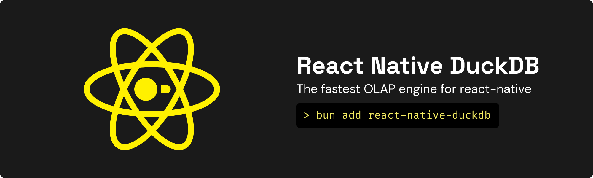

<p align="center">
  
</p>

<p align="center">
  <a href="https://www.npmjs.com/package/react-native-duckdb"></a>
  <a href="https://github.com/pranshuchittora/react-native-duckdb/blob/main/LICENSE"></a>
  
  
</p>

---

The analytical database for React Native. Run OLAP queries, full-text search, and vector similarity search on iOS and Android with native C++ performance via [Nitro Modules](https://nitro.margelo.com/).

- Columnar OLAP engine (not row-based OLTP like SQLite)
- Full-text search with BM25 ranking and 27 language stemmers
- Vector similarity search with HNSW indexing for on-device RAG/AI
- Remote data queries over HTTPS (Parquet, CSV, JSON, Hugging Face datasets)
- Streaming results for large datasets without OOM
- Bulk insert via Appender API
- Columnar typed array access (Float64Array, BigInt64Array)
- 30+ DuckDB types including HUGEINT, DECIMAL, ARRAY, MAP, STRUCT
- Query cancellation, progress callbacks, JSON profiling
- Expo config plugin for managed workflow

## Installation

```bash
npm install react-native-duckdb react-native-nitro-modules
```

For iOS, run `pod install` after installation.

## Quick Start

```ts
import { HybridDuckDB } from 'react-native-duckdb'

const db = HybridDuckDB.open(':memory:', {})

db.executeSync('CREATE TABLE users (id INTEGER, name VARCHAR, score DOUBLE)')
db.executeSync("INSERT INTO users VALUES (1, 'Alice', 95.5), (2, 'Bob', 87.3)")

const result = db.executeSync('SELECT * FROM users ORDER BY score DESC')
const rows = result.toRows()
// [{ id: 1, name: 'Alice', score: 95.5 }, { id: 2, name: 'Bob', score: 87.3 }]

db.close()
```

## Streaming Large Datasets

Process millions of rows chunk-by-chunk without loading everything into memory.

```ts
import { streamChunks } from 'react-native-duckdb'

const stream = await db.stream('SELECT * FROM large_table')
for await (const chunk of streamChunks(stream)) {
  processChunk(chunk.toRows())
}
```

See [docs/streaming.md](docs/streaming.md) for the Appender API, progress callbacks, and ETL patterns.

## Full-Text Search

BM25-ranked search with 27 language stemmers. Requires the `fts` extension.

```ts
db.executeSync("LOAD 'fts'")
db.executeSync("PRAGMA create_fts_index('docs', 'id', 'title', 'body', stemmer='english')")

const results = db.executeSync(`
  SELECT *, fts_main_docs.match_bm25(id, 'search query') AS score
  FROM docs WHERE score IS NOT NULL ORDER BY score DESC
`)
```

See [docs/fts.md](docs/fts.md) for multi-language stemming, field-specific search, and limitations.

## Vector Similarity Search

HNSW-indexed nearest-neighbor queries for on-device semantic search and RAG. Requires the `vss` extension.

```ts
db.executeSync("LOAD 'vss'")
db.executeSync('CREATE TABLE docs (id INTEGER, vec FLOAT[384])')
db.executeSync("CREATE INDEX idx ON docs USING HNSW (vec) WITH (metric = 'cosine')")

const similar = db.executeSync(`
  SELECT id, array_cosine_distance(vec, $query::FLOAT[384]) AS distance
  FROM docs ORDER BY distance LIMIT 10
`)
```

See [docs/vss.md](docs/vss.md) for distance metrics, use cases, and HNSW tuning.

## Extensions

Extensions are statically linked at build time. Configure in `package.json` (bare) or `app.json` (Expo):

```json
{
  "react-native-duckdb": {
    "build": {
      "extensions": ["core_functions", "parquet", "json"]
    }
  }
}
```

| Extension | Description |
|-----------|-------------|
| `core_functions` | Essential SQL functions (sum, avg, uuid, etc.) — **recommended** |
| `parquet` | Apache Parquet file format |
| `json` | JSON file format |
| `httpfs` | Remote file access over HTTPS |
| `fts` | BM25 full-text search |
| `vss` | HNSW vector similarity search |
| `sqlite_scanner` | Read SQLite databases |
| `icu` | Unicode collation and locale |
| `delta` | Delta Lake table format |
| `autocomplete` | SQL autocomplete |
| `tpch` / `tpcds` | Benchmark data generators |

See [docs/extensions.md](docs/extensions.md) for configuration details and per-extension guides.

**Expo:** Add to `app.json` plugins:

```json
["react-native-duckdb", { "extensions": ["core_functions", "parquet"] }]
```

See [docs/expo.md](docs/expo.md) for the full Expo guide.

## How It Compares

react-native-duckdb is an **OLAP** (Online Analytical Processing) database — optimized for analytical queries over large datasets. The libraries below are **OLTP** (Online Transaction Processing) databases — optimized for many small read/write transactions typical in app state management.

These are complementary paradigms. Use SQLite-based libraries for your app's transactional data (users, settings, state). Use DuckDB for analytics, search, and data processing.

| Feature | react-native-duckdb | nitro-sqlite | op-sqlite | WatermelonDB |
|---------|---------------------|--------------|-----------|--------------|
| **Engine** | DuckDB (columnar OLAP) | SQLite (row OLTP) | SQLite (row OLTP) | SQLite (row OLTP) |
| **Native bridge** | Nitro Modules (JSI) | Nitro Modules (JSI) | JSI | JSI |
| **Parquet/CSV/JSON file queries** | Yes | No | No | No |
| **Remote data (HTTPS)** | Yes (httpfs) | No | No | No |
| **Full-text search** | BM25 with 27 stemmers | FTS5 (compile flag) | FTS5 (compile flag) | No |
| **Vector search (HNSW)** | Yes | No | sqlite-vec plugin | No |
| **Columnar typed arrays** | Yes (Float64Array, etc.) | No | No | No |
| **Streaming results** | Yes (chunk-by-chunk) | No | No | No |
| **Bulk insert (Appender)** | Yes | No | No | Batch insert |
| **Query progress callbacks** | Yes | No | No | No |
| **Reactive queries** | No | No | Yes | Yes |
| **ORM / Model layer** | No (raw SQL) | TypeORM compatible | TypeORM compatible | Built-in |
| **Sync protocol** | No | No | No | Built-in |
| **Encryption** | No | No | SQLCipher | No |
| **Expo plugin** | Yes | No | No | No |

## Documentation

| Guide | Description |
|-------|-------------|
| [Extensions](docs/extensions.md) | Configuration, available extensions, per-extension usage |
| [Streaming & Appender](docs/streaming.md) | Chunk-by-chunk processing, bulk insert, ETL patterns |
| [Type System](docs/types.md) | DuckDB → JavaScript type mapping for all 30+ types |
| [Transactions](docs/transactions.md) | ACID transactions, batch execution, multi-database |
| [Full-Text Search](docs/fts.md) | BM25 indexing, stemmers, field search, limitations |
| [Vector Search](docs/vss.md) | HNSW indexes, distance metrics, RAG patterns |
| [Remote Data](docs/remote-data.md) | httpfs, Hugging Face datasets, S3, TLS config |
| [Expo Setup](docs/expo.md) | Config plugin, extension flow, migration guide |
| [Bare Workflow](docs/bare-workflow.md) | iOS/Android setup without Expo |

## License

MIT

---

<sub>Inspired by [react-native-nitro-sqlite](https://github.com/margelo/react-native-nitro-sqlite) and [op-sqlite](https://github.com/OP-Engineering/op-sqlite). Built with [DuckDB](https://duckdb.org) and [Nitro Modules](https://nitro.margelo.com). This project was built with AI (Claude) via the [Get Shit Done](https://github.com/gsd-build/get-shit-done) framework — every architectural decision was human-made. See [RELEASE.md](RELEASE.md) for release security details.</sub>
